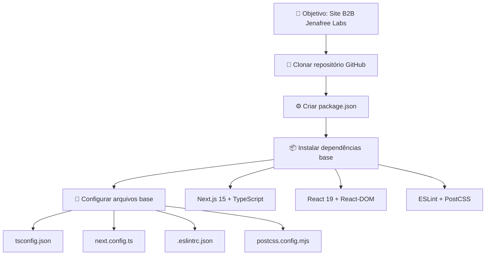
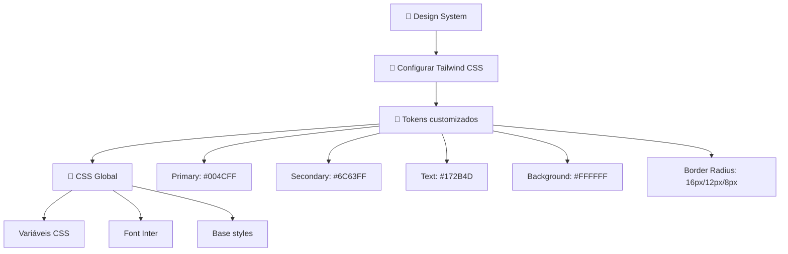
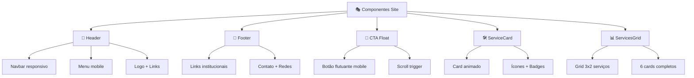
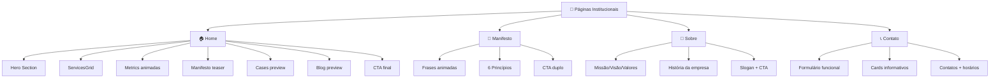
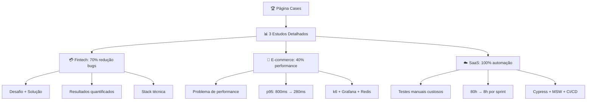
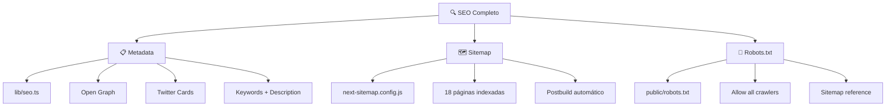
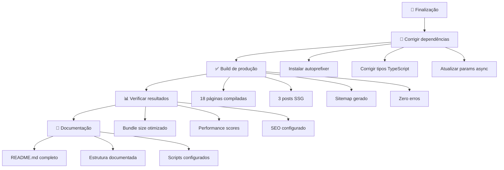

# 📋 Fluxograma Completo - Site Jenafree Labs

## 🎯 ETAPA 1: SETUP INICIAL



## 🎨 ETAPA 2: CONFIGURAÇÃO VISUAL



## 🧩 ETAPA 3: COMPONENTES UI

```mermaid
graph TD
    A[🧩 Componentes Base] --> B[📦 Instalar shadcn/ui]
    B --> C[🔧 Utils + Dependências]
    C --> D[🎛️ Componentes UI]
    
    C --> C1[clsx + tailwind-merge]
    C --> C2[@radix-ui/react-slot]
    C --> C3[class-variance-authority]
    
    D --> D1[Button]
    D --> D2[Card + Badge]
    D --> D3[Input + Textarea]
    D --> D4[Separator]
```

## 🏗️ ETAPA 4: ESTRUTURA DE PASTAS

```mermaid
graph TD
    A[📁 Estrutura App Router] --> B[🎯 Layout Principal]
    B --> C[📂 Grupo (site)]
    C --> D[📄 Páginas Institucionais]
    
    B --> B1[layout.tsx raiz]
    B --> B2[globals.css]
    
    C --> C1[layout.tsx do site]
    C --> C2[page.tsx - Home]
    
    D --> D1[/manifesto]
    D --> D2[/sobre]
    D --> D3[/contato]
    D --> D4[/servicos/*]
    D --> D5[/cases]
    D --> D6[/blog/*]
```

## 🎭 ETAPA 5: COMPONENTES DO SITE



## 📄 ETAPA 6: PÁGINAS PRINCIPAIS



## 🛠️ ETAPA 7: PÁGINAS DE SERVIÇOS

```mermaid
graph TD
    A[🛠️ Hub de Serviços] --> B[📋 Página Principal]
    A --> C[🤖 Automação]
    A --> D[⚡ Performance]
    A --> E[🔒 Segurança]
    A --> F[🚀 CI/CD]
    A --> G[🎨 Design QA]
    
    B --> B1[Grid 6 serviços]
    B --> B2[3 Planos de preço]
    B --> B3[CTAs direcionados]
    
    C --> C1[Playwright/Cypress]
    C --> C2[POM + DSL]
    C --> C3[Zero flakiness]
    
    D --> D1[k6 + Grafana]
    D --> D2[SLO/Thresholds]
    D --> D3[Stress/Load/Soak]
    
    E --> E1[SAST/DAST]
    E --> E2[OWASP Top 10]
    E --> E3[Pentest real]
    
    F --> F1[Quality gates]
    F --> F2[Preview deploys]
    F --> F3[Canary/Blue-green]
    
    G --> G1[WCAG AA/AAA]
    G --> G2[Visual regression]
    G --> G3[Design tokens]
```



## 🏆 ETAPA 8: CASES DE SUCESSO



## 📝 ETAPA 9: SISTEMA DE BLOG

```mermaid
graph TD
    A[📝 Sistema Blog] --> B[📦 Instalar gray-matter]
    B --> C[📚 Loader de posts]
    C --> D[📄 Páginas blog]
    D --> E[📰 3 Posts criados]
    
    C --> C1[getAllPosts()]
    C --> C2[getPostBySlug()]
    C --> C3[Front-matter parsing]
    
    D --> D1[/blog - Lista posts]
    D --> D2[/blog/[slug] - Post individual]
    
    E --> E1[QA sob Demanda]
    E --> E2[Playwright + POM + DSL]
    E --> E3[k6 na prática]
    
    E1 --> E1A[Redução de custos]
    E1 --> E1B[Case real fintech]
    E1 --> E1C[ROI comprovado]
    
    E2 --> E2A[Stack definitiva]
    E2 --> E2B[Zero flakiness]
    E2 --> E2C[Estrutura de projeto]
    
    E3 --> E3A[Performance no CI/CD]
    E3 --> E3B[Thresholds e SLO]
    E3 --> E3C[Case e-commerce]
```

## 🔍 ETAPA 10: SEO E OTIMIZAÇÃO



## 🚀 ETAPA 11: BUILD E DEPLOY



## 📊 RESULTADO FINAL

```mermaid
graph TD
    A[🎉 SITE COMPLETO] --> B[📱 18 Páginas]
    A --> C[🧩 11 Componentes]
    A --> D[📰 3 Posts Blog]
    A --> E[🔍 SEO Otimizado]
    A --> F[🚀 Pronto Deploy]
    
    B --> B1[4 Institucionais]
    B --> B2[6 Serviços]
    B --> B3[1 Cases]
    B --> B4[2 Blog]
    B --> B5[5 Subpáginas]
    
    C --> C1[Header/Footer]
    C --> C2[ServiceCard/Grid]
    C --> C3[CTAFloat/Metrics]
    C --> C4[PostCard/Testimonial]
    
    D --> D1[QA sob Demanda]
    D --> D2[Playwright + POM]
    D --> D3[k6 Performance]
    
    E --> E1[Metadata completo]
    E --> E2[Sitemap automático]
    E --> E3[Robots.txt]
    
    F --> F1[Build 100% funcional]
    F --> F2[Zero erros]
    F --> F3[Hot reload ativo]
```



---

## 🎯 RESUMO DOS 11 PASSOS:

1. **Setup** → Criar projeto Next.js + dependências
2. **Visual** → Configurar Tailwind + tokens customizados  
3. **UI** → Implementar componentes shadcn/ui
4. **Estrutura** → Organizar pastas App Router
5. **Componentes** → Header, Footer, Cards, Grid
6. **Páginas** → Home, Manifesto, Sobre, Contato
7. **Serviços** → Hub + 5 páginas detalhadas
8. **Cases** → 3 estudos de sucesso
9. **Blog** → Sistema completo + 3 posts
10. **SEO** → Metadata, sitemap, robots
11. **Deploy** → Build final + documentação

**🎊 RESULTADO: Site B2B profissional, 100% funcional, pronto para produção!**
